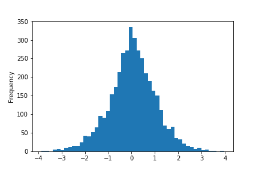

# Machine Learning Engineer Nanodegree
## Capstone Project - Use clustering and multiple tabular predictors to predict the 1-day future price of gold
### Neil Simon
### December 30, 2021

## I. Definition

### Project Overview

Predicting changes in the value of gold has obvious financial benefit including knowing when to buy or sell and determining future volatility. Historically, gold has been used as a currency, either directly or as backing for a paper currency (Gold's history as a currency standard, 2010) and it has proven to be a useful asset to hold during times of economic downturn and uncertainty. This is despite the relatively small role it plays as a functional material in the modern world.
The efficient market hypothesis (EMH) suggests that the market price reflects all information and that it should be impossible to consistently predict future prices of gold, and in particular, that it is impossible to consistently get returns greater than market level returns (Fama, E. F., 1970). Therefore, any system which is able to beat the market consistently would not only provide significant avenues for financial return, but also demonstrate that the EMH is not perfectly supported.
In this project, I implemented a system which divides gold prices into clusters using a K-Means predictor and related historical data, and based on the predicted cluster, uses a Tabular Predictor trained for that cluster to determine a predicted 1 day future return on gold.
Having analysed the results, and compared them with naive trading strategies, I have determined that none of the setups resulted in a system capable of predicting the future value of gold with any significant degree of accuracy.

### Problem Statement

The problem I attempted to solve is to predict the next day's gold price based on historical gold price trends and the Standard and Poors 500 index (S&P 500). To do this I performed the following tasks:

1. Retrieve the historical price of gold and historical values of the S&P 500.
1. Combine such into a suitable table of data.
1. Add additional columns of data expressing historical and most recent returns for gold and S&P 500.
1. Train a K-Means clustering system to predict clusters.
1. Train K different Tabular Predictors on data based on predicted cluster of said data.
1. Gather predictions on test data.
1. Compare results to actual returns on predicted days.
1. Iterate with different numbers for K (different numbers of clusters).
1. Evaluate final results.

By comparing predicted return and therefore price of gold with the actual market price I determined how accurately the model predicts such and the associated level of risk. Additionally, based on these predictions I extrapolated an expected return of the model over a long period and compare such with the actual market return and with other naive trading strategies.

### Metrics

The metrics I have applied in evaluating the predictions are relative cumulative return based on recommended trading, and accuracy.
To evaluate the cumulative return over the test data and compare such with the actual return:
$$return=\frac{closing\_price}{opening\_price} - 1$$
The cumulative return is just a matter of getting the product of all actual returns:
$$c\_return = (1 + return_1) * (1 + return_2) * ... * (1 + return_{n-1}) *(1 + return_{n})$$
Of course, if we know that the return is going to be positive (gold going up in value), it makes sense to buy or hold, and if it is going down, we sell. Therefore we can bring the concept of placing a buy or sell order and the ideal order is thus:
$$order_{ideal}=\begin{cases}
 +1 & \text{ if } return\geq  0 \\ 
 -1 & \text{ if } return< 0 
\end{cases}$$
Thus we can change the above to give an idealised return:
$$c\_return_{ideal} = (1 + order_1 * return_1) * (1 + order_2 * return_2) * ... $$
Assuming that the predicted values are the ideal, we can use the above and create a formula for $c\_return_{recommended}$ where we follow the recommendations of the system and use the following order formula:
$$order_{recommended}=\begin{cases}
 +1 & \text{ if } return_{predicted}\geq  0 \\ 
 -1 & \text{ if } return_{predicted}< 0 
\end{cases}$$
Thus the actual cumulative return, if following this strategy of trading recommended by the predicted values, is:
$$c\_return_{recommended}=(1 + order_1 * return_1) * (1 + order_2 * return_2) * ... $$

Thus we can compare the return that following the recommended system would give us, the return that simply holding gold would (simply the market return) and a fair random coin (an average cumulative return of 1). For comparing returns, it makes most sense to consider the market as the baseline and view the relative cumulative return of the recommendation system:

$$r\_return_{recommended}=\frac{c\_return_{recommended}}{c\_return}$$

A value greater than 1 would suggest a system that has outperformed the actual market.

As it is possible to outperform the market through random chance and since the cumulative return is a product of all the predictions, I also compare the $order_{ideal}$ and $order_{recommended}$ for accuracy to see if the system does a good job of accurately predicting the direction of gold prices.

$$accuracy = \frac{count(order_{ideal}==order_{recommended})}{number\_of\_samples}$$

A value consistently greater than 0.5 would indicate a greater degree of accuracy than pure chance.

Additionally, to check for bias, I calculated precision, recall and $F_1$ score.

$$precision = \frac{true\_positives}{true\_positives+false\_positives}$$

$$recall = \frac{true\_positives}{true\_positives+false\_negatives}$$

$$F_1 = 2*\frac{precision*recall}{precision+recall}$$

Other metrics, such as precision and recall do not make sense here as the relative rate of positives and negatives is close to 1. If the market was particularly weighted towards or against days with increases, then we would need to consider precision, recall/sensitivity, and specificity.

## II. Analysis

### Data Exploration

I have used a combination of 2 different datasets, one is the price of gold since 1994-12-06 and 2021-12-06, and the other the closing price of the S&P 500 between 2006-01-04 and 2021-12-03. These datasets were retrieved from:

1. Gold price: https://www.kaggle.com/nward7/gold-historical-datasets
2. S&P 500 Historical Data: https://ca.investing.com/indices/us-spx-500-historical-data

The gold price dataset included the following fields:

1. Date: in MMM DD, YYYY format
1. Price: Closing price in USD
1. Open: Opening price in USD
1. High: Daily high price in USD
1. Low: Daily low price in USD
1. Vol: Volume of traded gold
1. Change %: Daily return - not actually a percentage, but decimal fraction

The S&P 500 dataset included the following fields:

1. Date: in MMM DD, YYYY format
1. Price: Closing price in USD
1. Open: Opening price in USD
1. High: Daily high price in USD
1. Low: Daily low price in USD
1. Vol: Volume of traded - no values present
1. Change %: Daily return

As we can see, these datasets have many of the same fields, but for the purposes of the remainder of this project, I only used the date and closing price fields from these two datasets. By combining these two I created a third dataset with the date, gold closing price and S&P 500 closing price. The resulting dataset has 4008 records for trading days, starting at 2006-01-04. This resulted in a dataset with 3 fields:

1. Date
2. Gold Price
3. S&P Price

### Exploratory Visualization

For the purposes of visualisation, I created a chart showing the closing prices relative to the price on the first day:

From this we can see that the closing prices do have some degree of relationship, but not necessarily a very close one. I further decided to create a chart showing the price relative to the price at halfway through the dataset:

This chart shows a closer relationship. We can see a similar slope, but that when the S&P 500 market deviates down from that slope, the gold price increases, and vice versa. This suggests that gold is being treated as a safe haven for investors when the S&P 500 is performing poorly, and the S&P 500 is generally seen as a good indicator of the stock market in general. This in fact is the general consensus (Chen, 2021).

It is hoped that this feature of the price relationship between gold and the S&P 500 will provide information on the future price of gold.

### Algorithms and Techniques

I decided to add further information to each day's data to add 16 days worth of historical information to that day's data, and in so doing intended to provide relevant technical data about the historical price of gold and the S&P 500 over the preceeding days.

I decided to use a K-Means clustering algorithm to separate days into clusters based on the additional historical data added to each day's dataset. This was done to try to find days with similar historical trading returns, and cluster them together. Essentially, this would group certain "shapes" of trading patterns together.

For each cluster, I would train a Tabular Predictor with only days that belonged to that cluster. By doing so, I hoped to have Tabular Predictors which were experts in specific historical trading patterns and ultimately give better results than training as a single whole.

There are multiple ways to alter/tune this system:

* The number of clusters K.
* The additional historical information added to each day's data.
* Add other additional information such as other market historical information, such as the FTSE 100, the DAX or the Dow Jones.

For the purposes of this project, I only varied the number of clusters, using the values 1, 2, 4, 8, and 16. When using a single cluster, it was effectively equivalent to not using the K-Means clusteriser.

### Benchmark

The benchmarks against which I measure this system are:
1. The average return of a fair coin flip.
1. The market return.
1. The ideal trading return.

These benchmarks are all possible to derive trivially from the historical data, though in the case of the ideal trading return, it is only possible to do so using information not available when the trade in being "made".

The average return of a fair coin flip is 1 as the daily return is either positive or negative by the same proportion and with equal likelihood. The market return is easily gathered by just using the cumulative return as described in Metrics. Similarly, the ideal return is also described in the Metrics above.

There are no publically available models which perform significantly better than market return, so there are no other models against which it makes sense to compare.

## III. Methodology
_(approx. 3-5 pages)_

### Data Preprocessing

1. Add additional historical data to each day's data.
1. Normalise this data using the variance.
1. Verify that the data is suitably normally distributed.
1. Split the data into training and testing sets.

From this dataset I generated the gold return for the ranges of 1 day's return, 2 day's return ending yesterday, 4 day's return ending 3 days back, and 8 day's return ending 7 days back. The general formula for this is:
$$return_{(x,y)}=\frac{p_{n-x}-p_{n-x-y}}{p_{n-x-y}}$$
Where $p_{n}$ is todays gold price, and $p_{n-1}$ is yesterday's gold price, etc., $x$ is the number of days back we are looking to find the return at, and $y$ is the number of days over which the return is calculated. So for today's return (1 day's return ending today) $x=0$ and $y=1$, and for 4 day's return ending 3 days back $x=3$ and $y=4$.

I then normalised these features by getting the 16 day standard deviation on daily returns and dividing the return's by that (adjusted for the number of days over which the return was calculated). The normalization formula for these is:
$$return\_norm_{xy}=\frac{r_{xy}}{\sigma_{16}*\sqrt{2}{y}}$$
This resulted in 4 normalised return values for each day's gold price and a standard deviation value.

I applied the same approach to the S&P 500 data to create 4 normalised return values for each day, and a standard deviation value. Resulting in a total of 10 features with information for each day going back 16 days of trading. I added these additional features to each row to increase the amount of information about recent gold and S&P 500 returns, while not massively increasing the total amount of information in the dataset. While it would be possible to have just included the individual daily returns going back multiple days in each row, this would have increased the degrees over which the K-Means clustering operated, and therefore resulted in a less useful clustering process. My approach was to attempt to maximise the amount of information in each row, without increasing the number of features too greatly, so as to potentially benefit from the use of the K-Means clustering algorithm.

Ultimately, it is the one day future return ($\overline{return}_{(-1,1)}$) we are looking to calculate as from that we can determine tomorrow's price as we know today's price. So that was added as a label to the data for use in training and evaluation of the model.

After creating the normalised returns, I examined the data to make sure that it was somewhat close to normally distributed. While each does display some degree of variance from the expected normal distribution, it is sufficiently close to be assumed that it is normally distributed for the purposes of this project (see figures 4 through 11).

I determined that for the purposes of this project, the data was well formatted and did not appear to have any abnormalities.

Figures 4 through 11 show that we are dealing with relatively suitable data for analysis as it is close to normally distributed.

Additionally, this data was split into two sets of data for training and testing. The training set chosen was the first 3000 days of trading and the testing set was the last 992 days. The reason for not randomising this data before splitting into training and testing sets is that in doing so we could potentially introduce information about the future in the training data relative to the testing data, giving it a degree of knowledege of what trading patterns would be like in future relative to the data on which it was testing. Such would entirely defeat the purpose of this system as we do not and cannot train on data set in the future.

### Implementation

To implement the above approach, I used an AWS Sagemaker Jupyter Notebook (https://github.com/neilsimon/nd009t-capstone/blob/main/Capstone%20Training.ipynb). The initial step required was to pull the pre-processed data as was to be used, into the notebook as a Pandas dataframe.

I then split this data into training and testing data with 3000 days in the former and 992 in the latter.

For the purposes of the K-Means algorithm, I created versions of the data with the required features ('Normalised Gold Return', 'Normalised Gold Return 2 day back 1', 'Normalised Gold Return 4 day back 3', 'Normalised Gold Return 8 day back 7', 'Var 16 day', 'Normalised S&P Return', 'Normalised S&P Return 2 day back 1', 'Normalised S&P Return 4 day back 3', 'Normalised S&P Return 8 day back 7', 'Var 16 day.1'). This resulted in 10 features upon which the clustering algorithm would work.

To create a K-Means endpoint, I used the sagemaker library KMeans and trained it on the training set for the desired number of clusters (K initially set to 4). With the resulting model, I deployed a predictor endpoint and used that to get the clusters for each of the training and testing rows. I added this additional cluster information to the training and testing data for use with the Tabular Predictor.

To train the Tabular Predictors, I used an AutoGluon auto-ml setup derived from the AutoGluon SageMaker tutorials (Cloud Training with AWS SageMaker, n.d) and (Deploying AutoGluon Models with AWS SageMaker, n.d). These referenced a code repository from which the remaining code for training and deploying Tabular Predictors is derived (https://github.com/aws/amazon-sagemaker-examples/tree/master/advanced_functionality/autogluon-tabular-containers). The script was significantly modified to make it suitable for both training and predicting (https://github.com/neilsimon/nd009t-capstone/blob/main/scripts/hpo.py).

I split the training and testing sets into K different sets of each, and trained a Tabular Predictor on each of these clustered sets. Afterwards, I gathered the predictions for each cluster divided testing set and combined them into a single, date sorted prediction table, which I had written to a spreadsheet for further analysis.

Additionally, the time taken for the run from start to finish was recorded. This was done to determine how many clusters was the largest which I could reasonably deploy.

The most complicated part of deploying this implementation was finding a way to deploy the AutoGluon Tabular Predictor and verify that the setup for doing so was working correctly.

### Refinement

The largest refinement I undertook was to vary the number of clusters used. I had initially expected to just have the resources to do so for 4 clusters, but ultimately after I had everything working it was easy to add other cluster sizes and so I tried 1, 2, 4, 8, 16 and even 32. It was this last one that proved to be a problem as the AWS system did not permit my account to deploy 33 endpoints, as would be needed, and so the run crashed, leaving 30 endpoints deployed and ultimately consuming the remaining resources available.

Additionally, I changed the configuration used for training the Tabular Predictor after the first run as it was very quick in training using a "medium\_quality\_faster\_train" preset (https://github.com/neilsimon/nd009t-capstone/blob/main/ag_configs/config-med.yaml), so moving to the "best\_quality" preset (https://github.com/neilsimon/nd009t-capstone/blob/main/ag_configs/config-full.yaml) incurred only a small relative overall hit in processing time.

## IV. Results
_(approx. 2-3 pages)_

### Model Evaluation and Validation

The 5 successful runs of the system, with K sizes 1, 2, 4, 8, and 16 were compared with the market return, idealised return and fair coin flip return. The following results were achieved:

| Run Type    | C. Return | R. Return | Accuracy  | Precision | Recall    | F-Measure | RMSE      | T+D (s)   |
|-------------|-----------|-----------|-----------|-----------|-----------|-----------|-----------|-----------|
| 1 Cluster   | 0.813     | 0.627     | 0.467     | 0.530     | 0.130     | 0.209     | 0.010     | 1255      |
| 2 Clusters  | 0.978     | 0.754     | 0.485     | 0.543     | 0.305     | 0.391     | 0.027     | 1933      |
| 4 Clusters  | 1.191     | 0.919     | 0.500     | 0.537     | 0.549     | 0.543     | 0.038     | 2614      |
| 8 Clusters  | 0.924     | 0.713     | 0.487     | 0.534     | 0.406     | 0.461     | 0.049     | 4105      |
| 16 Clusters | 1.869     | 1.442     | 0.523     | 0.572     | 0.473     | 0.518     | 0.148     | 7653      |
| Coin Flip   | 1.000     | 0.772     | 0.500     | 0.541     | 0.500     | 0.520     |           |           |
| Always Buy  | 1.296     | 1.000     | 0.541     | 0.541     | 1.000     | 0.702     |           |           |
| Always Sell | 0.706     | 0.545     | 0.459     | 0.000     | 0.000     | 0.000     |           |           |

As we can see, the clustered approach as described above did not achieve particularly great results, generally failing to beat the naive approach of always buying and not even consistantly achieving better results than the coin flip approach to trading. The 2 setups that did achieve better results than the market (the always buying approach) were the 4 cluster and 16 cluster approaches. I suspect that this was more due to random chance than anything else.

In this section, the final model and any supporting qualities should be evaluated in detail. It should be clear how the final model was derived and why this model was chosen. In addition, some type of analysis should be used to validate the robustness of this model and its solution, such as manipulating the input data or environment to see how the model’s solution is affected (this is called sensitivity analysis). Questions to ask yourself when writing this section:
- _Is the final model reasonable and aligning with solution expectations? Are the final parameters of the model appropriate?_
- _Has the final model been tested with various inputs to evaluate whether the model generalizes well to unseen data?_
- _Is the model robust enough for the problem? Do small perturbations (changes) in training data or the input space greatly affect the results?_
- _Can results found from the model be trusted?_

### Justification
In this section, your model’s final solution and its results should be compared to the benchmark you established earlier in the project using some type of statistical analysis. You should also justify whether these results and the solution are significant enough to have solved the problem posed in the project. Questions to ask yourself when writing this section:
- _Are the final results found stronger than the benchmark result reported earlier?_
- _Have you thoroughly analyzed and discussed the final solution?_
- _Is the final solution significant enough to have solved the problem?_

## V. Conclusion
_(approx. 1-2 pages)_

### Free-Form Visualization
In this section, you will need to provide some form of visualization that emphasizes an important quality about the project. It is much more free-form, but should reasonably support a significant result or characteristic about the problem that you want to discuss. Questions to ask yourself when writing this section:
- _Have you visualized a relevant or important quality about the problem, dataset, input data, or results?_
- _Is the visualization thoroughly analyzed and discussed?_
- _If a plot is provided, are the axes, title, and datum clearly defined?_

### Reflection
In this section, you will summarize the entire end-to-end problem solution and discuss one or two particular aspects of the project you found interesting or difficult. You are expected to reflect on the project as a whole to show that you have a firm understanding of the entire process employed in your work. Questions to ask yourself when writing this section:
- _Have you thoroughly summarized the entire process you used for this project?_
- _Were there any interesting aspects of the project?_
- _Were there any difficult aspects of the project?_
- _Does the final model and solution fit your expectations for the problem, and should it be used in a general setting to solve these types of problems?_

### Improvement
In this section, you will need to provide discussion as to how one aspect of the implementation you designed could be improved. As an example, consider ways your implementation can be made more general, and what would need to be modified. You do not need to make this improvement, but the potential solutions resulting from these changes are considered and compared/contrasted to your current solution. Questions to ask yourself when writing this section:
- _Are there further improvements that could be made on the algorithms or techniques you used in this project?_
- _Were there algorithms or techniques you researched that you did not know how to implement, but would consider using if you knew how?_
- _If you used your final solution as the new benchmark, do you think an even better solution exists?_

-----------

**Before submitting, ask yourself. . .**

- Does the project report you’ve written follow a well-organized structure similar to that of the project template?
- Is each section (particularly **Analysis** and **Methodology**) written in a clear, concise and specific fashion? Are there any ambiguous terms or phrases that need clarification?
- Would the intended audience of your project be able to understand your analysis, methods, and results?
- Have you properly proof-read your project report to assure there are minimal grammatical and spelling mistakes?
- Are all the resources used for this project correctly cited and referenced?
- Is the code that implements your solution easily readable and properly commented?
- Does the code execute without error and produce results similar to those reported?

https://auto.gluon.ai/dev/tutorials/cloud_fit_deploy/cloud-aws-sagemaker-training.html
https://auto.gluon.ai/dev/tutorials/cloud_fit_deploy/cloud-aws-sagemaker-deployment.html

References:

* Gold's history as a currency standard. (2010). Retrieved from https://www.reuters.com/article/idINIndia-52748720101108
* Fama, E. F. (1970). Efficient Capital Markets: A Review of Theory and Empirical Work. The Journal of Finance, 25(2), 383–417. https://doi.org/10.2307/2325486
* Chen, J. (2021). Safe Haven. Retrieved from https://www.investopedia.com/terms/s/safe-haven.asp

* Raghuram, K. S. Statistical, Machine Learning predictive analytics and the impact of stock market indicators in predicting gold prices.
* Riazuddin, M. Predicting Gold Prices Using Machine Learning (2020). Retrieved from https://towardsdatascience.com/machine-learning-to-predict-gold-price-returns-4bdb0506b132
* Shah & Pachanekar (2021). Gold Price Prediction Using Machine Learning In Python. Retrieved from https://blog.quantinsti.com/gold-price-prediction-using-machine-learning-python/
* Datta P. (2021). Building A Gold Price Prediction Model Using Machine Learning. Retrieved from https://www.analyticsvidhya.com/blog/2021/07/building-a-gold-price-prediction-model-using-machine-learning/
